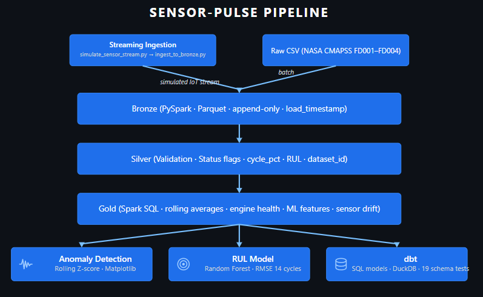
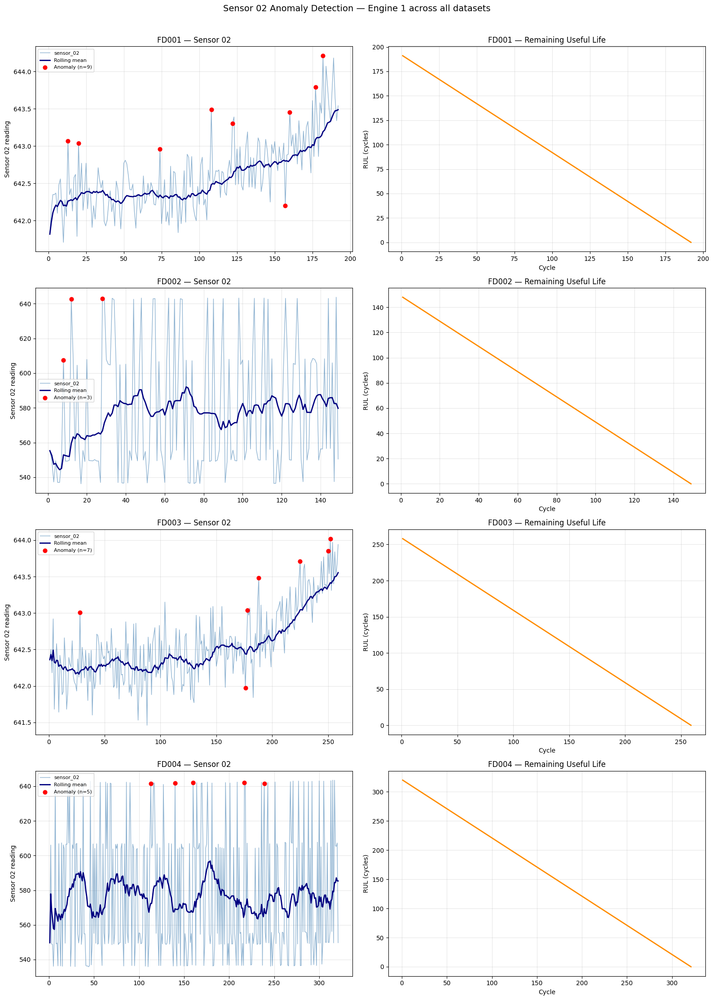
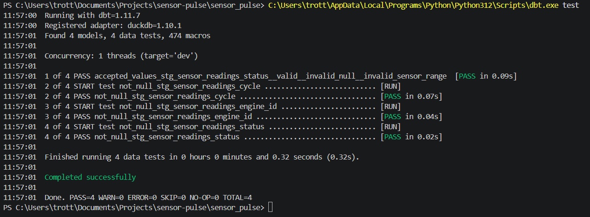

# sensor-pulse

End-to-end industrial sensor data pipeline and ML system built with PySpark, dbt, and Scikit-learn, following the Medallion Architecture (Bronze → Silver → Gold).

The pipeline processes NASA CMAPSS turbofan engine sensor data — 21 sensors per engine cycle measuring temperature, pressure, and rotation speed — across all four datasets (FD001–FD004). This mirrors the type of industrial IoT data found in manufacturing and process industries such as breweries, where predictive maintenance on fermentation tanks, compressors, and pumps is operationally critical.

---

## What's Built

| Notebook / Project | Description |
|--------------------|-------------|
| `sensor_pulse_pipeline.ipynb` | PySpark Medallion pipeline — Bronze → Silver → Gold on all 4 CMAPSS datasets |
| `anomaly_detection.ipynb` | Rolling Z-score anomaly detection per engine with visualizations |
| `rul_model.ipynb` | Random Forest baseline for Remaining Useful Life prediction |
| `sensor_pulse/` | dbt project — 4 models with schema tests on DuckDB |
| `ingestion/` | Simulated IoT streaming ingestion — emits sensor rows one at a time to JSONL, ingests to Bronze Parquet |

---

## Architecture





Each layer is written as **Parquet** — the columnar format used in Microsoft Fabric, Databricks, and other modern data platforms. The `createOrReplaceTempView` + Spark SQL pattern used in Gold runs unchanged in Fabric notebooks.

---

## Tech Stack

| Tool | Purpose |
|------|---------|
| PySpark | Distributed data transformations |
| Spark SQL | Window functions and analytics queries |
| Parquet | Columnar storage (Bronze → Silver → Gold) |
| dbt + DuckDB | SQL transformations and schema tests |
| Scikit-learn | Random Forest RUL prediction |
| Matplotlib | Sensor visualizations and model evaluation plots |
| NASA CMAPSS | Industrial sensor dataset (via Kaggle) |
| Google Colab | Notebook environment — no local setup required |

---

## Dataset

**NASA CMAPSS Turbofan Engine Degradation Simulation**

| Dataset | Engines | Rows | Operating conditions | Fault modes |
|---------|---------|------|----------------------|-------------|
| FD001 | 100 | 20,631 | 1 | 1 |
| FD002 | 260 | 53,759 | 6 | 1 |
| FD003 | 100 | 24,720 | 1 | 2 |
| FD004 | 249 | 61,249 | 6 | 2 |
| **Total** | **709** | **160,359** | | |

Source: [Kaggle — behrad3d/nasa-cmaps](https://www.kaggle.com/datasets/behrad3d/nasa-cmaps)

---

## Pipeline Details

### Bronze — Raw Ingestion
- Reads space-separated CSV with explicit schema (avoids silent type inference errors)
- Adds `load_timestamp` for data lineage
- Written as Parquet, append-only — raw data is never modified after insert

### Silver — Validation & Cleaning
- Null check on engine_id, cycle, and key sensors
- Sensor range check — physical sensors cannot return zero or negative values
- Invalid rows are **kept with status flags**, not deleted — lineage is preserved
- Derived columns: `max_cycle`, `cycle_pct` (position in engine lifetime 0→1), `rul`
- Gold filters on `WHERE status = 'valid'`

### Gold — Analytics & ML Features
Four tables built with Spark SQL window functions:

| Table | Description |
|-------|-------------|
| `rolling_averages` | 10- and 30-cycle rolling averages per engine — reveals degradation trends |
| `engine_health` | Per-engine summary: total cycles, avg sensor readings, life category |
| `ml_features` | Feature-engineered table: rolling mean, stddev, rate-of-change, RUL target |
| `sensor_drift` | Early life vs late life sensor comparison — quantifies degradation signal |

---

## Anomaly Detection

Rolling Z-score per engine and sensor over a 20-cycle window. A reading is flagged as anomalous when it deviates more than 2 standard deviations from the rolling mean:

```
z_score = (value − rolling_mean) / rolling_std
anomaly  = |z_score| > 2.0
```

The notebook visualises sensor readings with anomalies highlighted, and measures whether anomaly rate increases near end of life — validating that the detector is picking up real degradation signals rather than noise.



---

## RUL Prediction

Random Forest baseline trained on Gold-layer features.

**Key decisions:**
- **Engine-based train/test split** — engines 1–80 train, 81–100 test. Splitting on rows would leak late-cycle data from the same engine into training, making the model appear better than it is.
- **RUL capped at 125 cycles** — standard CMAPSS practice. Early-life cycles contribute little degradation signal; capping reduces noise in the target variable.
- **Per-operating-condition normalisation** for FD002/FD004 — sensor baselines shift between the 6 discrete operating conditions. Fitting a separate StandardScaler per condition prevents condition bias from entering the features.

**Features:** `sensor_02`, `sensor_04`, `sensor_11`, `s02_mean_10`, `s02_std_10`, `s02_delta`, `s04_delta`, `cycle_pct`

> **Data leakage note:** `max_cycle` (used to compute RUL) is derived from the full run-to-failure trajectory and would be unknown in a live system. Metrics below are optimistic relative to a deployed predictor.

---

### Results

| Dataset | RMSE  | MAE  | Operating conditions | Fault modes |
|---------|-------|------|----------------------|-------------|
| FD001   | 14.01 | 9.14 | 1                    | 1           |
| FD002   | 11.56 | 7.61 | 6                    | 1           |
| FD003   | 14.01 | 8.74 | 1                    | 2           |
| FD004   | 11.70 | 7.18 | 6                    | 2           |

**RMSE** — average prediction error in engine cycles. RMSE of 14 means the model is on average 14 cycles off when predicting time to failure.

**MAE** — median prediction error in cycles, less sensitive to outliers than RMSE.

FD002 and FD004 achieve lower RMSE despite 6 operating conditions — per-condition normalisation effectively captures sensor variance from varying loads.

---

## dbt Models

The `sensor_pulse/` directory contains a dbt project on DuckDB with 4 models and schema tests.

```
sensor_pulse/
├── models/
│   ├── staging/
│   │   ├── stg_sensor_readings.sql   ← validation, status flags, RUL
│   │   └── schema.yml                ← not_null + accepted_values tests
│   └── marts/
│       ├── mart_engine_health.sql    ← per-engine summary
│       ├── mart_ml_features.sql      ← feature-engineered ML input
│       └── mart_sensor_drift.sql     ← early vs late life comparison
```

### Run dbt

```bash
cd sensor_pulse
pip install dbt-duckdb
dbt run
dbt test

```

---

## Key Design Decisions

**Explicit schema over inference**
Defining the schema manually avoids silent type errors that can propagate through the pipeline undetected — especially important when sensor columns have no headers.

**Status flags over deletion**
Invalid rows are flagged (`invalid_null`, `invalid_sensor_range`) and retained in Silver. Data lineage is preserved — Gold simply filters on `status = 'valid'`. In production, these flags would trigger alerts before the bad data reaches downstream consumers.

**Parquet over CSV**
Columnar format enables predicate pushdown and compression. Same data is ~10x smaller than CSV and significantly faster to query at scale. Parquet is the native format in Microsoft Fabric OneLake.

**Spark SQL for Gold**
Gold analytics use `createOrReplaceTempView` + Spark SQL — the same pattern used in Microsoft Fabric notebooks and Databricks. Transforms are portable across execution engines without rewriting.

---

## How to Run

### Spark pipeline + ML notebooks (Google Colab)
Open any of the three notebooks in Google Colab and run all cells. PySpark, the dataset, and all dependencies are installed automatically in the first cell.

```python
!pip install pyspark kagglehub matplotlib scikit-learn -q
```

Recommended order:
1. `sensor_pulse_pipeline.ipynb` — builds Bronze → Silver → Gold
2. `anomaly_detection.ipynb` — anomaly scores on top of Silver
3. `rul_model.ipynb` — RUL prediction on top of Gold features

### dbt (local)
```bash
cd sensor_pulse
pip install dbt-duckdb
dbt run
dbt test
```

### Streaming ingestion (local simulation)

Demonstrates how real-time sensor data would flow into Bronze in a production IoT environment. Since CMAPSS is a static dataset, the simulator replays rows from FD001 one at a time to emulate a live sensor feed. See `ingestion/README.md` for full documentation.
```bash
python ingestion/ingest_to_bronze.py        # Terminal 1
python ingestion/simulate_sensor_stream.py  # Terminal 2
```

Currently streams FD001 — extend by pointing `INPUT_FILE` at any dataset.
---

## Relation to Other Projects

This project focuses on **PySpark, distributed data processing, and ML for industrial IoT**.
For a SQL-native pipeline using PostgreSQL and pandas, see
[finance-data-pipeline](https://github.com/TERK93/finance-data-pipeline) —
same Medallion Architecture, different execution engine and domain.
'
